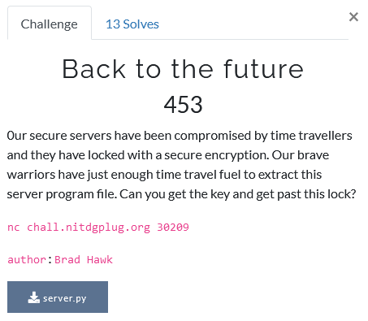

# Back to the future

Foobar CTF - Crypto 453 (13)

## Challenge



Time Travellers, eh? Sorry, but we cannot allow anyone to disobey the cosmic speed limit, so let's reel these guys in. The full server code looks like this.

```py
#!/usr/bin/env python3

import arrow
import json
import random
import sys

keys = {
    "a": 15498798452335698516189763255,
    "b": 4  
}

with open('flag') as f:
    flag = f.read()

with open('/dev/urandom', 'rb') as f:
    rand = f.read(8)

rand_int = int(rand.hex(), 16)

random.seed(rand_int)

offset = random.randint(-1623476442, 1623476442)


while True:
    sys.stdout.write('''Server's open..  for now
Would you like to get ->
  1. current time
  2. access to sanctum sanctorum
  3. goodbye
:''')
    sys.stdout.flush()
    response = input('')
    if response == '1':
        time = int(arrow.utcnow().timestamp()) - offset
        enc_time = pow(time, keys['b'], keys['a'])
        sys.stdout.write(
            'This NTP server has been taken over by time-travellers!!!\n')
        sys.stdout.write('Time mixed with sweet RSA!\n')
        sys.stdout.write(str(enc_time))
        sys.stdout.write('\n')
        sys.stdout.flush()
    elif response == '2':
        time = int(arrow.utcnow().timestamp()) - offset
        random.seed(time)
        guessing_int = random.randint(0, 99999999999)
        sys.stdout.write('''Only Dr.Strange with time-stone can access this area! To prove your worth guess the passcode by looking into the future!\n''')
        sys.stdout.flush()
        response = input('=> ')
        if response == str(guessing_int):
            sys.stdout.write('''Wow, guess you are a wizard, Harry XD\n''')
            sys.stdout.write(flag)
            sys.stdout.write('\n')
            break
        else:
            sys.stdout.write('''Imposter!''')
            sys.stdout.write('\n')
            break
    else:
        print('Farewell traveller...')
        break
```

Upon connection we are greeted with a lonely taunt by those pesky cosmic speeders :C. We get two options:

1. The current UTC time offset by a random, but static value. Encrypted with known small RSA parameters.
2. Try to access the 'sanctum sanctorum'. However, to do so we need to predict a random value.


## Solution

Upon taking a closer look at the server code, we see the random module is used to generate a random value called 'offset', which is in turn used to seed the random module when we try to enter the 'sanctum sanctorum'. In order to be able to construct this seed ourselves we need to recover this 'offset' value. To do this, we can use our first option. This returns an RSA encrypted timestamp. 

Although the public key (N, e) is given, and the modulus N is easily factorised into primes, the public component is even which is always at least a little bit cumbersome. To crack RSA with an even component, especially when it is rather small, we can make use of modular square roots. It is however important to note that these square roots need to be taken modulo a prime, while the RSA uses a ring of size N, which is not prime by definition.

The easiest approach to this would be to factorise our modulus N and choose the largest of the available primes for the modular square roots in the hope that p > m. In fact, we can check this beforehand because we know what the messages will look like: UTC timestamp +/- offset. Luckily for us, this is indeed the case. If it were not the case, however, we needed to find the mod square roots for both p and q, and then combine them using CRT.

Because our public exponent e = 4, we can do with two successive mod square roots, which leaves us with a whopping 4 possible messages. Trying this on some of the received messages once or twice already shows us that the correct message (timestamp) is in fact the smalles one. So, we aks for an encrypted timestamp and decrypt it. Now we can construct the seed for the random module and correctly predict their passcode. It seems we have just entered the 'sanctum sanctorum'!

To achieve the flag, I used the code below.

```py
#!/usr/bin/env python3

# Imports
from pwn import *
import arrow
import random
import numpy as np

def legendre_symbol(a, p):
    """
    Legendre symbol
    Define if a is a quadratic residue modulo odd prime
    http://en.wikipedia.org/wiki/Legendre_symbol
    """
    ls = pow(a, (p - 1)//2, p)
    if ls == p - 1:
        return -1
    return ls

def prime_mod_sqrt(a, p):
    """
    Square root modulo prime number
    Solve the equation
        x^2 = a mod p
    and return list of x solution
    http://en.wikipedia.org/wiki/Tonelli-Shanks_algorithm
    """
    a %= p

    # Simple case
    if a == 0:
        return [0]
    if p == 2:
        return [a]

    # Check solution existence on odd prime
    if legendre_symbol(a, p) != 1:
        return []

    # Simple case
    if p % 4 == 3:
        x = pow(a, (p + 1)//4, p)
        return [x, p-x]

    # Factor p-1 on the form q * 2^s (with Q odd)
    q, s = p - 1, 0
    while q % 2 == 0:
        s += 1
        q //= 2

    # Select a z which is a quadratic non residue modulo p
    z = 1
    while legendre_symbol(z, p) != -1:
        z += 1
    c = pow(z, q, p)

    # Search for a solution
    x = pow(a, (q + 1)//2, p)
    t = pow(a, q, p)
    m = s
    while t != 1:
        # Find the lowest i such that t^(2^i) = 1
        i, e = 0, 2
        for i in range(1, m):
            if pow(t, e, p) == 1:
                break
            e *= 2

        # Update next value to iterate
        b = pow(c, 2**(m - i - 1), p)
        x = (x * b) % p
        t = (t * b * b) % p
        c = (b * b) % p
        m = i

    return [x, p-x]


# Connection
host = "chall.nitdgplug.org"
port = 30209

s = remote(host,port)

context.log_level = 'debug'


# Get the encrypted time (contains the offset)
s.recv()
s.sendline('1')

s.recvuntil('\n')
s.recvuntil('\n')

enc_time = int(s.recvuntil('\n', drop=True).decode('ascii'))


# Send our guess based on seed derived from the decrypted time
s.recv()
s.sendline('2')

s.recvuntil('\n')

# Largest prime of N, which > m
p = 50700462220707155573

# Decrypt enc_time
time = min(np.array([prime_mod_sqrt(i,p) for i in prime_mod_sqrt(enc_time,p)]).flatten())

# Set seed
random.seed(time)

# Our guess
guess = random.randint(0, 99999999999)

s.sendline(str(guess))


s.interactive()
```


Ta-da!
```
GLUG{7h3_fu7ur3_15_n0w}
```