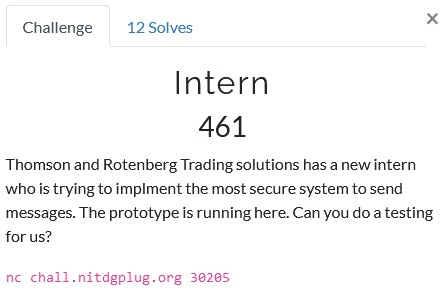

# Intern

Foobar CTF - Crypto 461 (12)

## Challenge



Upon netcat connection we are greeted with an RSA modulus and public exponent. Ding ding, e=3 is not secure and might be exploitable, let's keep that in mind. We have two choices
- request a state upon which we receive a random \~69-bit number
- receive an encrypted flag to which a random number is added

** Rabbit Hole #1 - Coppersmith's short-pad attack **

But what do they mean with added? Numerically, or as some sort of padding? At first I assumed the latter and tried to apply a Coppersmith's short-pad attack, it returned the following.

```
Do you really think LCG with RSA will make secure system btw flag is GLUG{n44m_l3k3_k44m_4151_50urc3_73r3a\xe7\xc1\xd2\xc6\xe2\xb19o
```

So hey, we got a part of the flag, but it seems like the end is missing. So it seems we were wrong about the padding, the number is actually added numerially and not as some sort of padding... We will need another approach, luckily the recovered part of the flag mentions 'LCG'.

## Solution

So it seems like they use a linear congruential generator (LCG) to generate the random numbers. If we can get a bunch of 'randomly' generated numbers from it, we can use that to consruct the LCG ourselves and reliably predict the next value. Then, if we ask for two ciphertexts we receive
```py
C1 = encrypt( flag + rand_num_1 )
C2 = encrypt( flag + rand_num_2 )
```

Because we have constructed the LCG we know what rand_num_1 and rand_num_2 are, so we know the numerical difference between the messages. Or in other words, these two ciphertexts are related by a known difference. If we rewrite the above to
```py
C1 = encrypt( flag )
C2 = encrypt( flag + (rand_num_2 - rand_num_1) )
```
we can use the Franklin-Reiter related message attack. I used the Python script below to obtain the ciphertexts and the added 'random' numbers.

```py
#!/usr/bin/env sage -python

# Imports
from pwn import *
from Crypto.Util.number import bytes_to_long, long_to_bytes
from functools import reduce
from math import gcd


# Functions
# Euclidean greatest common divisor
def egcd(a, b):
    if a == 0:
        return (b, 0, 1)
    else:
        g, x, y = egcd(b % a, a)
        return (g, y - (b // a) * x, x)

# Modular inverse
def modinv(b, n):
    g, x, _ = egcd(b, n)
    if g == 1:
        return x % n


# LCG as RN_n+1 = ( increment + multiplier * RN_n ) % modulus
def LCG_Constructor(rolls):
    # Recover modulus
    diffs = [c1 - c0 for c0, c1 in zip(rolls, rolls[1:])]
    zeroes = [d2*d0 - d1*d1 for d0, d1, d2 in zip(diffs, diffs[1:], diffs[2:])]
    modulus = abs( reduce(gcd, zeroes) )
    # Recover multiplier
    multiplier = (rolls[2] - rolls[1]) * modinv(rolls[1] - rolls[0], modulus) % modulus
    # Recover increment
    increment = (rolls[1] - rolls[0] * multiplier) % modulus
    return modulus, multiplier, increment


# Connection
host = "chall.nitdgplug.org"
port = 30205

s = remote(host, port)


# Get RSA parameters
s.recvuntil('N : ', drop=True)
N = int(s.recvuntil('\n', drop=True))
s.recvuntil('e : ', drop=True)
e = int(s.recvuntil('\n', drop=True))


roll_lst = []
# Take some rolls to predict the LCG
for i in range(154):

	s.recvuntil('$ ')

	s.sendline('1')
	s.recvuntil('you: ',timeout=.4)

	roll = int(s.recvuntil('\n', drop=True))
	print(roll)

	roll_lst.append(roll)


# Construct the LCG
n, a, b = LCG_Constructor(roll_lst)

# Check LCG prediction
chck_num = ( a * roll_lst[-1] + b ) % n

s.recvuntil('$ ')

s.sendline('1')
s.recvuntil('you: ',timeout=.4)

roll = int(s.recvuntil('\n', drop=True))
assert roll == chck_num

# Next 2 rolls
next_num1 = ( a * roll + b ) % n
next_num2 = ( a * next_num1 + b ) % n


# Get 2 encrypted flags
s.recvuntil('$ ')

s.sendline('2')
s.recvuntil('num): ')

c1 = s.recvuntil('\n', drop=True).decode('ascii')

s.recvuntil('$ ')

s.sendline('2')
s.recvuntil('num): ')

c2 = s.recvuntil('\n', drop=True).decode('ascii')


# Close connection
s.close()


# Print
print('Got it, here you go :)')
print('N:', N)
print('e:', e)
print('c1:', next_num1, c1)
print('c2:', next_num2, c2)
print()
```

Finally I applied the Franklin-Reiter attack in Sage using the following script.

```py
### RUN IN SAGE ENVIRONMENT ###

# Imports
from Crypto.Util.number import long_to_bytes

# RSA parameters
n = 79486203821426028598805256387454301145312119345767154768161561282750473121395476088815015288993336899624516908888291057610536957748502868167459132342106961091464094174400211502823356761413226800969654388200072883977601040106965234133288388244188970137876019799151801492307027992561414119837032040050310555187
e = 3

# rand_num_2 - rand_num_1
r = 208732893796551881126

# Related ciphertexts
c1 = 54892102885039487746178146580508329859123624015062804225705482148116729355525968429152413761851271370225380882724293719232984941210965881777485836530629674733375126695082166730923577189943830294930401328679772965774332133586651957331193237277451038932729530547826084219376694057278693870361639537597935249060
c2 = 34187803623506222391213336376670721052370781139676971628942062647777140557100223193332932101243633376990276162735282349044471911100017393688213971791769933659673978724217736987559901639431013723480823478025917941431984864923370289703750222505185000243981522353669741842669924899861009155239277561793060367287

# Function
def FranklinReiter(n, e, r, c1, c2):
	# Set-up Pol space
    R.<X> = Zmod(n)[]
    # Polynomials
    f1 = X^e - c1
    f2 = (X + r)^e - c2
    # Return
    # Coefficient 0 = -m, so
    return Integer(n-(compositeModulusGCD(f1,f2)).coefficients()[0])

# Print resulting message
print(long_to_bytes(franklinReiter(n,e,r,c1,c2)-38991140224961274973))
```
Which finally returns us the full plain text
```
Do you really think LCG with RSA will make secure system btw flag is GLUG{n44m_l3k3_k44m_4151_50urc3_73r3_bh41_k1}
```
Voilá!
```
GLUG{n44m_l3k3_k44m_4151_50urc3_73r3_bh41_k1}
```