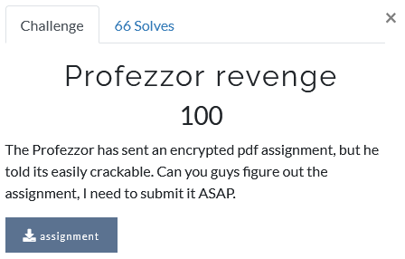
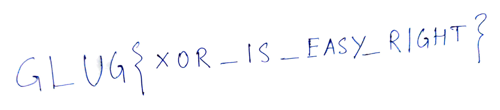

# Profezzor revenge

Foobar CTF - Crypto 100 (66)

## Challenge



We are given an encrypted PDF, most likely encrypted with XOR considering the information given and points awarded. However, upon opening it we get an error message saying that the file format is not recognised...

## Solution

Upon closer inspection of its hexdump we can see that the hex signature ('magic numbers') of the PDF file is wrong, namely

```py
actual = b'\x25\x50\x44\x46'
pdfhex = b'\x8b\xaa\xfe\xf8' 
```

PDFs often also have a large space of zero bytes, and in our case the encrypted file has a repeating pattern of four bytes, so perhaps the XOR key is only four bytes long. Let's see what we get if we XOR the actual and PDF hex signatures.

```py
pdfkey = long_to_bytes(bytes_to_long(actual) ^ bytes_to_long(pdfhex))
print(pdfkey)

b'\xae\xfa\xba\xbe'
```

Exactly the same as in the zero-block! Well let's just try to decrypt the whole file using that four-byte key and see what comes out. Once decrypted, the PDF contains something peculiar... a flag!



Ta-da!
```
GLUG{XOR_IS_EASY_RIGHT}
```