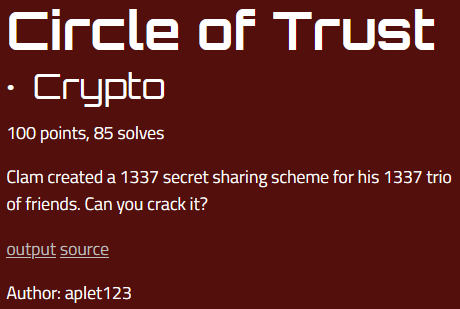

# Circle of Trust

angstromCTF - Crypto 100 (85)

## Challenge



Looking at the source code we see the flag is encrypted with AES using a random 128-bit key and IV. There's no brute-forcing that :c. However, we are given three clues of the form
```py
BOUND = 2 ** 128
MULT = 10 ** 10

def nums(a):
    b = Decimal(random.randint(-a * MULT, a * MULT)) / MULT
    c = (a ** 2 - b ** 2).sqrt()
    if random.randrange(2):
        c *= -1
    return (b, c)

x = Decimal(random.randint(1, BOUND * MULT)) / MULT
for _ in range(3):
    (a, b) = nums(x)
    print(f"({keynum + a}, {ivnum + b})")
```
or more simply put
```
clue 1:   ( key  +  y1 , iv  +/-  sqrt( x**2 - y1**2 ) )
clue 2:   ( key  +  y2 , iv  +/-  sqrt( x**2 - y2**2 ) )
clue 3:   ( key  +  y3 , iv  +/-  sqrt( x**2 - y3**2 ) )
```

Seems to me we have a system of equations on our hands with 6 equations (two for each clue) and 6 unknowns (key, iv, x, y1, y2, y3), which means we can solve this! Using Ci = key + yi and Pi = iv +/- sqrt( x\*\*2 - yi\*\*2 ), we can quite simply math our way out of this challenge.

There is a catch however, and that's the +/- sign which is randomised in the source code. There's no way to predict it so strictly speaking this adds three more unknowns to our system making it unsolvable. Luckily, the parameter space of these unknowns is small, namely only 1 or -1. Brute-forcing these unknows should be fine then. Hence let's rewrite Pi to Pi = iv + ii sqrt( x\*\*2 - yi\*\*2 ). Alright, math time!

## Solution

Let's try to solve the above system for the key first by eliminating the other variables, except for the i's as their parameter space is sufficiently small to just brute-force.


And so we find


And equivalently,


This leaves us with the following root function of which we can derive the keys using a root-finding algorithm, such as the bisection method. This method is perfect for simple functions, such as this one.


Now that we have our possible keys, we can find the IV from the key using


To do this for all possible combinations of (i2, i3) I used the Python script below.

```py
# Imports
from decimal import Decimal, getcontext
from Crypto.Util.number import long_to_bytes, bytes_to_long
from Crypto.Cipher import AES
# Set context for required precision
getcontext().prec = 100


# Root-finding through the bisection method
def bisection(f,a,b,N,args=(1,1)):
    if f(a,args)*f(b,args) >= 0:
        print("Bisection method fails.")
        return None
    a_n = a
    b_n = b
    for n in range(1,N+1):
        m_n = (a_n + b_n)/Decimal(2)
        f_m_n = f(m_n,args)
        if f(a_n,args)*f_m_n < 0:
            a_n = a_n
            b_n = m_n
        elif f(b_n,args)*f_m_n < 0:
            a_n = m_n
            b_n = b_n
        elif f_m_n == 0:
            print("Found exact solution.")
            return m_n
        else:
            print("Bisection method fails.")
            return None
    return (a_n + b_n)/Decimal(2)


# Set challenge parameters
C1, P1 = Decimal(457020213401268758000507112920047694562582161398)/Decimal(1e10), Decimal(31020634442404276336820538929941614215700357571144)/Decimal(1e11)
C2, P2 = Decimal(55221733168602409780894163074078708423359152279)/Decimal(1e9), Decimal(34788496561380896247486644841834767173970270575362)/Decimal(1e11)
C3, P3 = Decimal(147829667933855179054593001600696671775906950984)/Decimal(1e10), Decimal(34024000394165154334507454055942629110169490484699)/Decimal(1e11)
flag = 0x838371cd89ad72662eea41f79cb481c9bb5d6fa33a6808ce954441a2990261decadf3c62221d4df514841e18c0b47a76


# Math-reversed function
def rip(x, iss):
    # Get +/- 
    i2, i3 = iss
    # Return
    return (P3-P2) + i2 * ( (C2-x)**2 - (C1-x)**2 - (P1-P2)**2 )/(2*(P1-P2)) + i3 * ( (C3-x)**2 - (C1-x)**2 - (P1-P3)**2 )/(2*(P1-P3))


# For every combination of +/-
for itry in [[1,1],[-1,1],[1,-1],[-1,-1]]:
    print('Trying:', itry)
    # Get key
    try:
        key = round(bisection(rip, Decimal(2**120), Decimal(2**128), 100000, args=itry))
    except:
        continue
    print(len(bin(int(key))[2:]), int(key))
    # Get IV
    iv = round(P2 - itry[0] * ( (C2-key)**2 - (C1-key)**2 - (P1-P2)**2 ) / 2 / (P1-P2))
    print(len(bin(int(iv))[2:]), int(iv))
    print()
    # Decrypt
    try:
        cipher = AES.new(long_to_bytes(int(key)), AES.MODE_CBC, iv=long_to_bytes(int(iv)))
        enc = cipher.decrypt(long_to_bytes(flag))
        print(enc)
    except:
        print("Decryption failed.")
    print()
    # Print y's as visual check
    y1 = C1 - key; print(y1)
    y2 = C2 - key; print(y2)
    y3 = C3 - key; print(y3)
    print()
    print()
    print()
```
It printed the following output.

```py
Trying: [1, 1]
key: 126 57407752119141346115689979226038752825
iv : 128 327290741356445954560249394326998648495

b'\x10\xc9\xafX<\xcd\xca\xf1\x8fVl:In\x81\x00\xe4\xc8\xbf\xde\xccL\xf1\x84U\x80\xd2\xae\t\x17\xf4\xadqs\x05{\xb9\x1b\xbb\x9a\xc34\xa5 `\xbc\xe5\xcc'

y1: -11705730779014470315639267934033983368.7417838602
y2: -2186018950538936334795816151960044401.640847721
y3: -42624785325755828210230679065969085647.4093049016


Trying: [-1, 1]
key: 125 25282875485697341000124615264572955172
iv : 129  360362662290837446005497176507802429898

Decryption failed.

y1: 20419145854429534799926096027431814284.2582161398
y2: 29938857682905068780769547809505753251.359152279
y3: -10499908692311823094665315104503287994.4093049016


Trying: [1, -1]
key: 125 37208231231867697178862544207654698732
iv : 128 332394261916597077667241952352964236593

b'actf{elliptical_curve_minus_the_curve}\x00\x00\x00\x00\x00\x00\x00\x00\x00\x00'

y1: 8493790108259178621188167084350070724.2582161398
y2: 18013501936734712602031618866424009691.359152279
y3: -22425264438482179273403244047585031554.4093049016


Trying: [-1, -1]
key: 126 77090347147886029295375901184191442611
iv : 129 373452106257006342146615869788007565700

Decryption failed.

y1: -31388325807759153495325189892186673154.7417838602
y2: -21868613979283619514481738110112734187.640847721
y3: -62307380354500511389916601024121775433.4093049016
```

Ta-da!
```
actf{elliptical_curve_minus_the_curve}
```