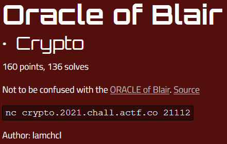

# Oracle of Blair

angstromCTF - Crypto 160 (136)

## Challenge



Taking a look at the server we see we are dealing with a simple AES-CBC decryption oracle. In other words, we can give the server any number of cipher texts and it will decrypt it for us. Interestingly, if we send a cipher text with the byte-equivalent of '{}' it will replace it for us with the flag!

```py
from Crypto.Cipher import AES
from Crypto.Util.Padding import pad
import os

key = os.urandom(32)
flag = open("flag","rb").read()

while 1:
	try:
		i = bytes.fromhex(input("give input: "))
		if not i:
			break
	except:
		break
	iv = os.urandom(16)
	inp = i.replace(b"{}", flag)
	if len(inp) % 16:
		inp = pad(inp, 16)
	print(
		AES.new(key, AES.MODE_CBC, iv=iv).decrypt(inp).hex()
	)
```

So in order to retrieve the flag, we need to abuse the way AES-CBC decryption works. The notable thing here is that the decryption of a given cipher text is always the same except for the first block, which is xor'ed with the random IV. In a more schematic way it looks like


So if we give the cipher text C0-C1-C2-C3-...-Ci we receive a plain text P0-Pi, with D( ) as the decryption function, given as below.

```py
D( C0 ) ^ iv  =  P0
D( C1 ) ^ C0  =  P1
D( C2 ) ^ C1  =  P2
D( C3 ) ^ C2  =  P3
...
D( Ci ) ^ C{i-1}  =  Pi
```
See the pattern?

## Solution

Because each cipher text block is used in the next block to xor it with the next decrypted input block, any cipher text effectively leaves its marks in two plain text blocks. So for instance, consider a payload consisting of 2 zero-byte blocks, followed by '{}' which becomes 2 flag blocks, and some more zero blocks.

```py
payload1 = 32*'0' + 32*'0' + '7b7d' + 64*'0'
```

This will result in us receiving the following plain texts

```py
D( 0  ) ^ iv  =  P0
D( 0  ) ^ 0   =  P1
D( F1 ) ^ 0   =  P2
D( F2 ) ^ F1  =  P3
D( 0  ) ^ F2  =  P4
```

Using the xor identities A ^ 0 = A and A ^ A = 0, we can single out the second flag block as

```py
P1 ^ P4  =  (D(0) ^ 0) ^ (D(0) ^ F2)  =  F2
```

The first flag block however, is xor'ed with the decrypted block of the second flag block. We can send another block to single out this value and xor it with the previously received block to recover the first flag block. To do this, we consider the following payload.
```py
payload2 = 32*'0' + F2
```

This wil yield the following plain texts (with a new random IV) as

```py
D( 0  ) ^ iv`  =  P0`
D( F2 ) ^ 0    =  P1`
```

From this, and our previous payload, we can recover the first flag block!

```py
P3 ^ P1`  =  (D(F2) ^ F1) ^ (D(F2) ^ 0)  =  F1
```

To get both flag blocks I used the script below.

```py
# Imports
from Crypto.Util.number import long_to_bytes, bytes_to_long

# Split hex output into 32 character (16 byte) blocks
def blocker(out):
    return [out[i:i+32] for i in range(0,len(out),32)]

# XOR two blocks with each other
def blcxor(blc1, blc2):
    return long_to_bytes( int(blc1,16) ^ int(blc2,16) )

# Construct the first payload
payload1 = 32*'0' + 32*'0' + '7b7d' + 64*'0'
print(payload1)
# Output of first payload
out = "a6f35fff892c5ffc32a2dc6f6a51832984867582d48488ff73bae1d47cb0e10fba1bdcba752c079caa7a7c07969a1e800f44faa7e797186f249b0b2cd20bb5d2efe32ae7b7e6d79c0ebae1d47cb0e10f28cc1a73c4b821dc70371e8817c47cec"
# Block it up
blc1 = blocker(out)
# Get second half of the flag
F2 = blcxor(blc1[1], blc1[4])
print(F2)

# Construct the second payload
payload2 = 32*'0' + F2.hex()
print(payload2)
# Output of second payload
out = "cabc7622ea7e828aee29fc4575ce3c846e278ec19cf47a0c7bf6645eb754d9bb"
# Block it up
blc2 = blocker(out)
# Get first half of the flag
F1 = blcxor(blc1[3], blc2[1])
print(F1)

# Combine the halfs
flag = F1 + F2
print(flag.decode('ascii'))
```
```c
00000000000000000000000000000000000000000000000000000000000000007b7d0000000000000000000000000000000000000000000000000000000000000000

b'ke_ecb_c}\x00\x00\x00\x00\x00\x00\x00'

000000000000000000000000000000006b655f6563625f637d00000000000000

b'actf{cbc_more_li'
```

Ta-da!
```
actf{cbc_more_like_ecb_c}
```