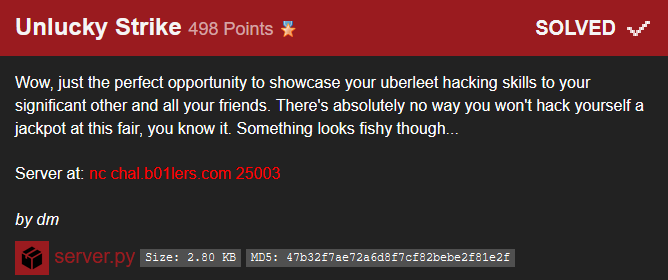

# Chall name

CTF origin - Category points (solves)

## Challenge




## Solution

**Rabbit Hole #1: Plain Padding Oracle Attack**


**Solution: Encryption Padding Oracle Attack**

```py
#!/usr/bin/env python3

# Imports
from pwn import *
import base64
from Crypto.Util.number import long_to_bytes


# Connection
host = "chal.b01lers.com"
port = 25003

s = remote(host, port)

context.log_level = 'debug'


# Get losing ticket >n<
s.recvuntil('raffle ticket:\n')
ticket = base64.b64decode(s.recvuntil('\n', drop=True).decode())

# Get winning numbers
s.recvuntil('winning numbers are:\n')
lststr = s.recvuntil('\n', drop=True).decode()
winlst = [int(i) for i in lststr[1:-1].split(', ')]


# PADDING ORACLE ENCRYPTION ATTACK
# Construct payload
payload = b'numbers:' + ','.join([str(i) for i in winlst]).encode()
padpay = payload + (16-len(payload)%16) * long_to_bytes(16-len(payload)%16)
print(padpay)
print()

# Our payload ticket (starts off as a random ciphertext)
tick_pl = b'\xaa'*16*5
print(tick_pl)

# For every block in our payload (without iv)
for blc in range(4):
    
    # Get blocks up to current block
    rtb = tick_pl[:len(tick_pl)-16*blc]
    #print(rtb)
    
    D = b''

    # For every byte in our block
    for byt in range(1,17):

    	# Pad accordingly
        pb = bytes([D[i] ^ byt for i in range(len(D))][::-1])
        padbyt = rtb[:(len(rtb)-16)-(byt-1)] + pb + rtb[-16:]

        # Just to be sure :)
        assert len(padbyt) == len(rtb)

        # Iterate over all possible bytes
        b_correct = None
        pos_lst = []
        for b in range(256):

        	# Convert to bytearray for item assignment
            trytick = bytearray( padbyt )

            # Set trial byte
            trytick[-16 - byt] = b

            # Again, just to be sure :)
            assert len(trytick) == len(rtb)

            # Time to check the validity of our padding (the attack part)

            # Send ticket
            s.recvuntil('Redeem a ticket:\n')
            s.sendline( base64.b64encode( ticket + trytick ) )

            # Get response
            resp = s.recvuntil('\n', drop=True).decode()

            if resp == 'that is an invalid ticket':
            	check = False

            elif resp == 'sorry, that ticket did not win anything':
            	check = True

            # Keep byte if accepted
            if check:
                pos_lst.append(b)
                break

        # Only keep the correct byte (padding degeneracy)
        if len(pos_lst) == 1:
            b_correct = pos_lst[0]
        elif len(pos_lst) == 2:
            b1,b2 = pos_lst
            if b1 == padbyt[-16 - byt]:
                b_correct = b2
            if b2 == padbyt[-16 - byt]:
                b_correct = b1
        else:
            print(pos_lst)
            raise ValueError('Oh oh...')
          
        # Get decrypted value
        D += long_to_bytes(b_correct ^ byt)
        
    # Get payload block
    pl_blc = padpay[len(padpay)-16*(blc+1):len(padpay)-16*blc]
    
    # Create ciphertext block i-1 such that encryption of C_i yields P_i
    C_rep = bytes([pl_blc[i] ^ D[-(i+1)] for i in range(16)])
    
    # Update our malicious winning ticket >:)
    tick_pl = tick_pl[:len(padpay)-16*(blc+1)] + C_rep + tick_pl[len(padpay)-16*blc:]
    
print()
print(tick_pl)

# Send final winning ticket
s.recvuntil('Redeem a ticket:\n')
s.sendline( base64.b64encode( tick_pl ) )

s.interactive()
```

```
flag{}
```